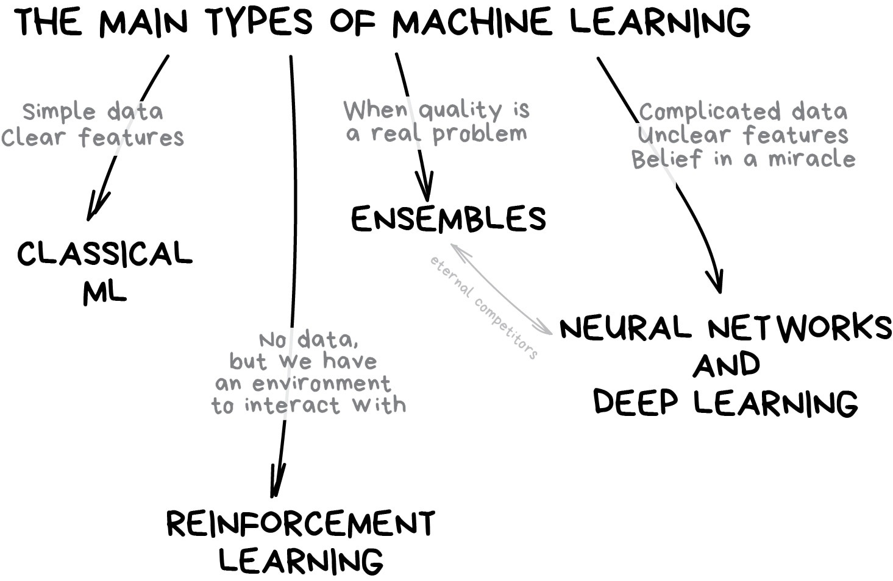

# Part 1: Introduction to Machine Learning

## Problem statement

We want to set a price for an Airbnb listing in Vienna based on its features, such as location, type of accommodation, number of bedrooms, and amenities.

## What is Machine Learning?

Machine learning is about extracting knowledge from data.

It is a research field at the intersection of statistics, artificial intelligence, and computer science and is also known as predictive analytics or statistical learning.

The application of machine learning methods has in recent years become ubiquitous in everyday life.
- From automatic recommendations of which movies to watch,
- to what food to order or which products to buy,
- to personalized online radio
- recognizing your friends in your photo
- many modern websites and devices have machine learning algorithms at their core.

## Machine learning map

Main Types of Machine Learning:

Source: [Machine Learning for Everyone](https://vas3k.com/blog/machine_learning/)

The map helps us understand the different types of machine learning and their applications.

Source: [Machine Learning for Everyone](https://vas3k.com/blog/machine_learning/)

Classical Machine Learning:

Source: [Machine Learning for Everyone](https://vas3k.com/blog/machine_learning/)

## Workflow of a machine learning project

- **Data**
    - To be able to answer your question with any kind of certainty, you need a good amount of data of the right type. There are two things you need to do at this point
        - *Collect data*: Collect your data with care, be aware of the sources of this data, any inherent biases it might have, and document its origin.
        - *Prepare data*: Normalize it if it comes from diverse sources, converting strings to numbers, clean and edit the data, randomize it and shuffle it.
- **Features and Target**
    - A **feature** is a measurable **property of your data**. 
        - In many datasets it is expressed as a column heading like 'date', 'size' or 'color'.
        - Your feature variable, usually represented as `X` in code, represent the **input variable** which will be used to train model.
    - A **target** is the thing you are trying to predict. 
        - The target is usually represented as `y` in code, represents the answer to the question you are trying to ask of your data.
- **Selecting your feature variable**
    - How do you know which variable to choose when building a model?
    - You'll probably go through a process of feature selection or feature extraction to choose the right variables for the most performant model.
    - **Feature extraction** creates new features from functions of the original features.
    - **Feature selection** returns a subset of the features.
- **Visualize your data**
    - An important aspect of the data scientist's toolkit is the power to visualize data using several excellent libraries such as Seaborn or MatPlotLib.
    - Representing your data visually might allow you to uncover hidden correlations that you can leverage.
    - Your visualizations might also help you to uncover bias or unbalanced data.
- **Split your dataset**
    - Prior to training, you need to **split your dataset into two or more parts of unequal size** that still represent the data well.
    - **Training**:
        - This part of the dataset is fit to your model to train it.
        - This set constitutes the majority of the original dataset.
    - **Testing**:
        - A test dataset is an independent group of data, often gathered from the original data, that you use to confirm the performance of the built model.
    - **Validating**:
        - A validation set is a smaller independent group of examples that you use to tune the model's hyperparameters, or architecture, to improve the model. Depending on your data's size and the question you are asking, you might not need to build this third set.
- **Decide on a training method**
    - Depending on your question and the nature of your data, you will choose a method to train it.
    - Evaluate the performance of a model by feeding it unseen data, checking for accuracy, bias, and other quality-degrading issues, and selecting the most appropriate training method for the task at hand
- **Train a model**
    - `fit` it to create a model.
    - You will notice that in many ML libraries you will find the code `model.fit`
- **Evaluate the model**
    - Once the training process is complete (it can take many iterations, or 'epochs', to train a large model), you will be able to evaluate the model's quality by using test data to gauge its performance.
    - This data is a subset of the original data that the model has not previously analyzed.
    - **Model fitting**: Refers to the accuracy of the model's underlying function as it attempts to analyze data with which it is not familiar.
    - **Underfitting** and **overfitting** are common problems that degrade the quality of the model, as the model fits either not well enough or too well.
        - This causes the model to make predictions either too closely aligned or too loosely aligned with its training data.
        - An `overfit` model predicts training data too well because it has learned the data's details and noise too well.
        - An `underfit` model is not accurate as it can neither accurately analyze its training data nor data it has not yet seen.
- **Parameter tuning**
    - Once your initial training is complete, observe the quality of the model and consider improving it by tweaking its 'hyperparameters'.
- **Prediction**
    - This is the moment where you can use completely new data to test your model's accuracy.

## scikit-learn

- `scikit-learn` is an open source project, meaning that it is free to use and distribute, and anyone can easily obtain the source code to see what is going on behind the scenes.
- The scikit-learn project is constantly being developed and improved, and it has a very active user community.
- It contains a number of state-of-the-art machine learning algorithms, as well as comprehensive documentation about each algorithm.
- scikit-learn is a very popular tool, and the most prominent Python library for machine learning.
- It is widely used in industry and academia, and a wealth of tutorials and code snippets are available online. 
- scikit-learn works well with a number of other scientific Python tools.
- scikit-learn is built on top of the NumPy and SciPy scientific Python libraries.

Webpage: https://scikit-learn.org/stable/

API reference: https://scikit-learn.org/stable/modules/classes.html

Examples: https://scikit-learn.org/stable/auto_examples/index.html

Scikit-learn makes it straightforward to build models and evaluate them for use. It is primarily focused on using numeric data and contains several ready-made datasets for use as learning tools. It also includes pre-built models for students to try.

