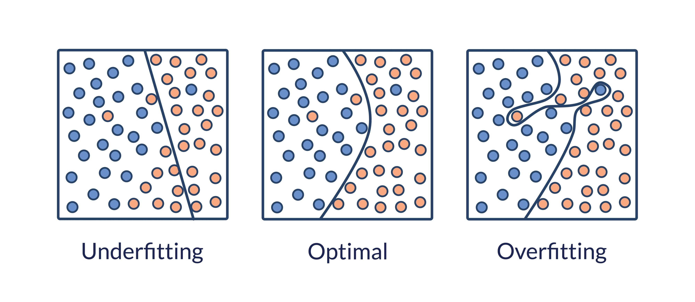

# Part 4: Training, Evaluation, and Model Usage

At this stage, we finally have what every machine learning project needs: a clean dataset with well-defined features and a clear target. Now the goal is to use that prepared data to train a model, measure how well it performs, and then use it to make predictions on completely new Airbnb listings.

## Splitting Your Dataset

Prior to training, you must split your pristine dataset into separate parts of unequal size.
- **Training Set (Usually 80%)**: This part of the dataset is fit to your model to train it. It constitutes the majority of the data and acts as the "textbook" the algorithm studies to learn the relationship between the features and the target.
- **Testing Set (Usually 20%)**: This is an independent, unseen group of data. We hide this from the model during training. Once the model thinks it has learned the rules, we use the test set to give it a "final exam" and confirm its true performance.

Why is this important? Because evaluating a model on the exact same data it has already seen tells us almost nothing. That would be like giving a student the answer sheet before the test. A useful model must perform well on new, unfamiliar examples.

## Choosing a Training Method

Once the data is split, we have to decide which type of model to train. Because our target is a numeric price, this is a **regression** problem.

For an introductory workshop, it makes sense to start with simple regression models:
- **Linear Regression**: The classic baseline model. It tries to describe the relationship between the features and the target using a straight-line mathematical relationship.
- **Decision Tree Regressor**: A more flexible model that splits the data into branches based on decision rules. This can capture more complex relationships than linear regression, but it also carries a higher risk of overfitting.

Trying more than one model is useful because different algorithms make different assumptions about the data. Comparing them helps us understand which approach fits our Airbnb pricing problem best.

## Training the Model

Training is the moment where the algorithm learns from the examples in the training set. In practice, this often comes down to one deceptively simple line of code:

`model.fit(X_train, y_train)`

This is where the math happens. The model analyzes the feature values in $X$ and the known prices in $y$, then adjusts its internal parameters so that it can make better predictions.

In other words, the model is building a rule that maps listing characteristics such as room count, location, or amenities to an estimated nightly price.

## Evaluating the Model

After training, we need to measure how well the model performs on unseen data. This is done by feeding the testing features into the model:

`model.predict(X_test)`

The predictions are then compared with the real prices from the test set. This tells us how close the model's guesses are to reality.

One of the simplest and most useful evaluation metrics is **Mean Absolute Error (MAE)**. It answers the question: *On average, how far off is the model?* If the MAE is 20, then our model is wrong by about €20 per prediction on average.

For beginners, this is a very intuitive way to judge model quality, because it translates directly into real-world pricing error.

## Overfitting and Underfitting

Not all low-error models are truly good models. A machine learning model can fail in two common ways:
- **Underfitting**: The model is too simple to capture the real patterns in the data. It performs poorly on both the training set and the test set.
- **Overfitting**: The model has learned the training data too well, including its noise and accidental quirks. It may perform extremely well on the training set but poorly on the test set.

The goal is to find a balance where the model learns the underlying structure of the data without merely memorizing it.

## Hyperparameter Tuning

Once an initial model is working, we can often improve it by adjusting its **hyperparameters**. These are settings chosen before training begins.

For example:
- A decision tree can be made deeper or shallower.
- Some models can be regularized more strongly to reduce overfitting.
- We can experiment with different settings and compare the resulting test performance.

Hyperparameter tuning is an important part of practical machine learning because even a good model type can perform badly if its settings are poorly chosen.

## Using the Model for Prediction

The final step is the most satisfying one: using the trained model on brand-new data.

At this point, we can invent a completely new Airbnb listing, for example a two-bedroom apartment near the city center with a balcony and Wi-Fi, convert those listing details into the same feature format used during training, and feed the new $X$ into the model.

The output is the predicted price $y$. This is the moment where all the earlier work comes together: data gathering, cleaning, feature engineering, training, and evaluation.

